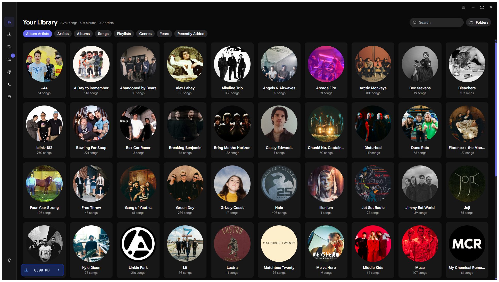
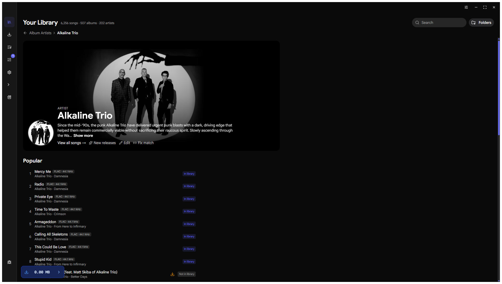
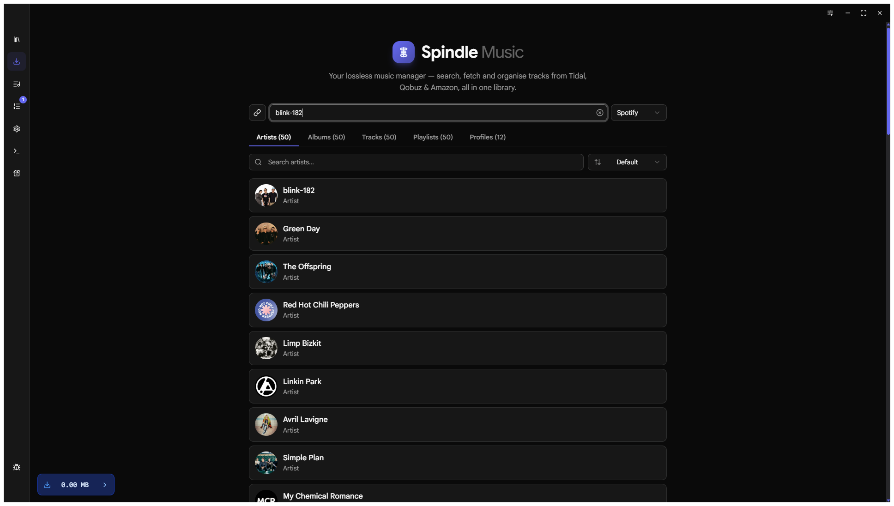
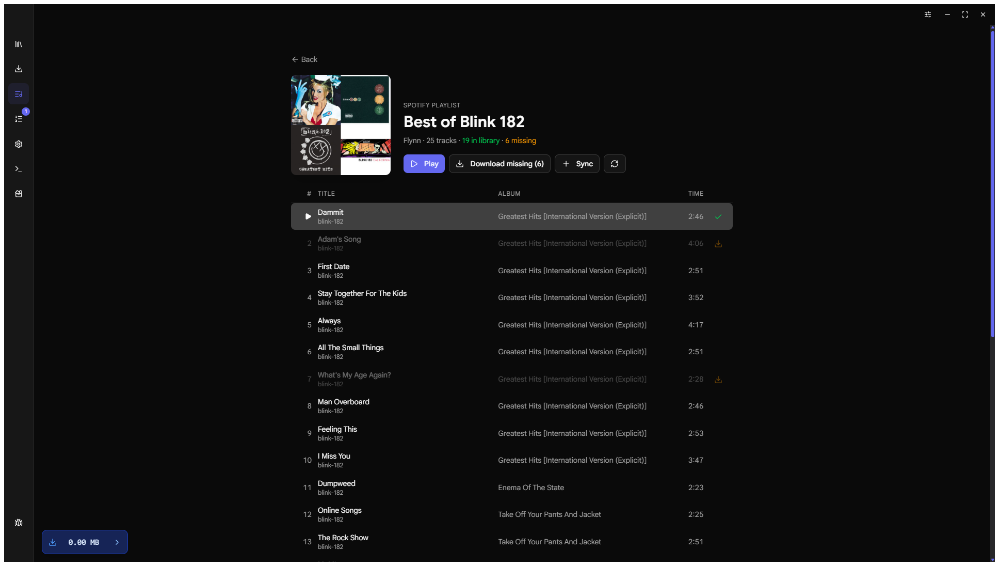
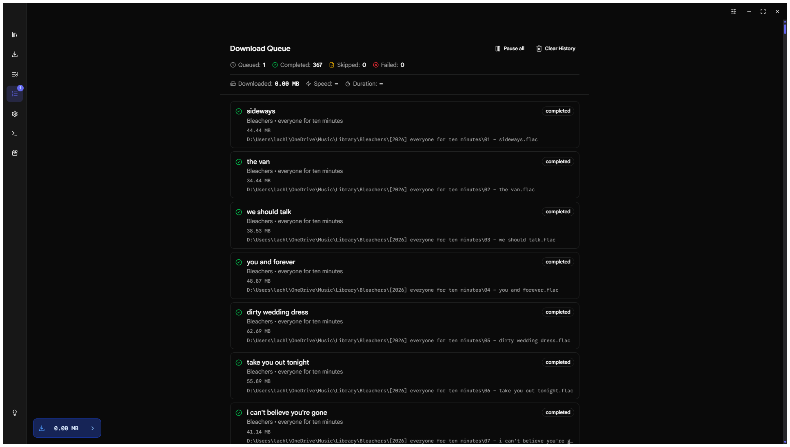
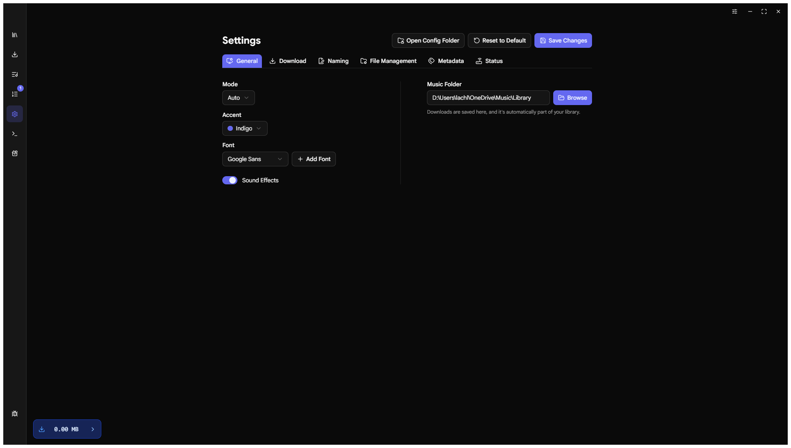

<div align="center">

# 🌀 Spindle Music Manager

**A lossless music library manager and downloader for the desktop.**

Organize a pristine FLAC library, browse it like a streaming app, and fill in the gaps —
Spindle finds what's missing and downloads it in true lossless quality, tagged and filed
exactly where it belongs.

Built with Go + [Wails](https://wails.io) and React. Windows · macOS · Linux.

</div>

---

## ✨ Features

### 🗂️ Library
- **Plex-style library** over your local files — artists, albums, songs, years, genres, all backed by a fast SQLite index with realtime folder watching
- **Built-in player** with queue and seeking that stays smooth while downloads run
- **Quality stamps everywhere** — codec, sample rate, and bitrate shown on album cards and track rows straight from the files
- **Artist pages** with bio, popular tracks, discography, public playlists, and a **New releases** check that diffs an artist's full discography against your library
- **Metadata editing** for tracks, albums, and artists, with automatic artist enrichment (art, bios, top tracks)
- **Safe deletes** — remove albums or selections from the library and disk in one step; sidecar junk (covers, logs, cue sheets, lyrics) is cleaned up with them
- **Self-healing index** — files moved or renamed outside the app are re-scanned and stale entries pruned automatically

### ⬇️ Downloading
- **Search anything** — artists, albums, tracks, playlists, even public profiles — and download it in FLAC (up to 24-bit hi-res where available)
- **Multiple sources** with automatic fallback, plus a direct Qobuz catalog search for music that's no longer on streaming
- **Library-aware** — existing files are detected and skipped; everything lands in your `Artist/[Year] Album/NN - Title` structure no matter where the download started
- **Real queue** — persistent across restarts, pause/resume, retry failed, multi-select removal, animated per-track progress, and add-while-downloading
- **Server-break aware** — when a source takes a scheduled break, the queue waits it out and resumes by itself instead of failing
- **Lyrics on autopilot** — synced `.lrc` files saved next to every download (toggleable)
- **Cover art, M3U8 export, and download reports** included

### 🎯 Playlist Sync
- Track any Spotify playlist against your library — owned tracks light up, missing ones are dulled out
- Download just the missing songs with one click; they file into your normal artist/album structure
- **Fix match** lets you pin a playlist or popular track to the exact local file it should count as

### 🛠️ Toolbox
- Audio quality analyzer (spectrum + codec inspection), converter, resampler, file manager, and lyrics manager
- FFmpeg auto-installed on first run

## 📸 Screenshots

| Library | Artist page |
|---|---|
|  |  |

| Search & download | Playlist sync |
|---|---|
|  |  |

| Download queue | Settings |
|---|---|
|  |  |

## 🚀 Getting Started

Grab the latest build from [Releases](../../releases):

| Platform | File |
|---|---|
| Windows | `Spindle.exe` (portable) |
| macOS | `Spindle.dmg` |
| Linux x64 | `Spindle.AppImage` |
| Linux ARM64 | `Spindle-ARM.AppImage` |

First launch: add your music folder under **Library → Manage folders**. Spindle scans it,
builds the index, and keeps watching for changes. Your first library folder doubles as the
download destination, so downloads become part of the library the moment they finish.

App data (library DB, playlists, artist art, config) lives in `~/.spindle`.

> **Linux** needs `webkit2gtk-4.1` (`sudo apt install libwebkit2gtk-4.1-0` on Ubuntu/Debian).

## 🔧 Building from Source

Requirements: Go 1.26+, Node 24+, pnpm, and the [Wails CLI](https://wails.io/docs/gettingstarted/installation).

```bash
git clone https://github.com/loliver1823/spindle.git
cd spindle
cd frontend && pnpm install && cd ..
wails dev      # live-reload development build
wails build    # production binary in build/bin
```

## ⚙️ How files are organized

Spindle names files with configurable templates. The default layout:

```
Library/
└── Bleachers/
    └── [2026] everyone for ten minutes/
        ├── 01 - sideways.flac
        ├── 01 - sideways.lrc
        └── ...
```

Templates, existing-file detection, source order, embedded art quality, and lyric
behaviour are all configurable in **Settings**.

## ⚠️ Disclaimer

Spindle is a library management tool, not affiliated with or endorsed by Spotify, Tidal,
Qobuz, Amazon Music, or any other service. Downloading copyrighted material may be illegal
in your country — use it only for content you have the right to access, and support the
artists you love.

## 📄 License

[MIT](LICENSE)
